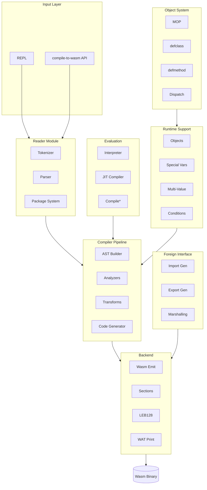
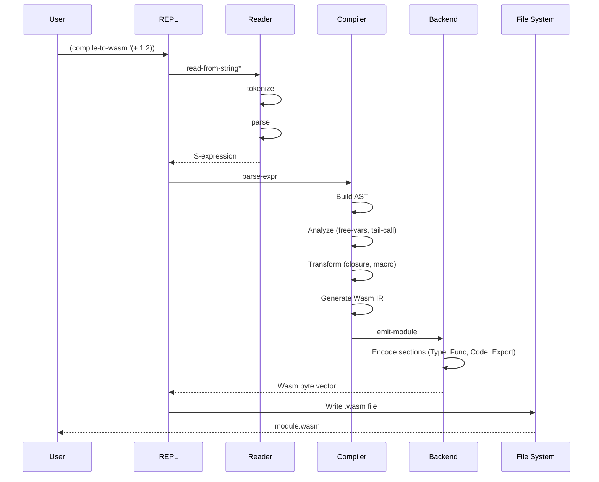
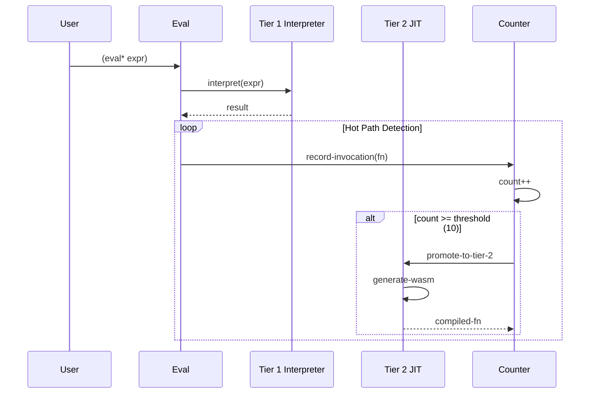

# Clysm Architecture Document

## 1. Overview

### Purpose

Clysm is a **Common Lisp to WebAssembly GC compiler**. It compiles Common Lisp source code to WebAssembly binary format using the WasmGC (Garbage Collection) proposal, enabling Lisp programs to run in WebAssembly runtimes without linear memory management.

### Key Use Cases

- Compile Common Lisp expressions to WebAssembly modules
- Execute Lisp code via tiered evaluation (interpreter + JIT)
- Provide CLOS (Common Lisp Object System) support
- Enable FFI to host environments (JavaScript/wasmtime)

### Non-Goals

- Full ANSI Common Lisp conformance (subset implementation)
- Linear memory usage (WasmGC structs/arrays only)
- Native compilation (Wasm is the only target)

## 2. System Architecture



## 3. Execution Flow

### Compilation Flow



### Tiered Evaluation Flow



## 4. Modules & Dependencies

### Layer Structure

| Layer | Module | Responsibility |
|-------|--------|----------------|
| 0 | `backend/leb128` | LEB128 encoding for Wasm binary |
| 0 | `backend/sections` | Wasm section builders |
| 1 | `backend/wasm-emit` | Module binary emission |
| 1 | `backend/wat-print` | WAT text output (debug) |
| 2 | `compiler/ast` | AST node definitions |
| 2 | `compiler/env` | Lexical environment |
| 3 | `compiler/analyzer/*` | Free vars, tail call, type inference |
| 3 | `compiler/transform/*` | Closure conversion, macro expansion |
| 4 | `compiler/codegen/*` | Wasm IR, GC types, sections |
| 5 | `compiler/compiler` | Top-level compile API |
| 2 | `reader/tokenizer` | Lexical analysis |
| 2 | `reader/parser` | S-expression parsing |
| 2 | `reader/package` | Package system |
| 3 | `reader` | Reader facade |
| 3 | `runtime/objects` | Object representation |
| 3 | `runtime/special-vars` | Dynamic binding |
| 3 | `runtime/multi-value` | Multiple values |
| 4 | `conditions/*` | Condition system |
| 4 | `clos/*` | Object system |
| 5 | `ffi/*` | Foreign function interface |
| 6 | `eval/interpreter` | Tier 1 interpreter |
| 6 | `eval/jit` | Tier 2 JIT |
| 6 | `eval/compile` | Tiered compilation |
| 7 | `lib/macros` | Standard macros |
| 8 | `repl` | Read-Eval-Print Loop |

### External Dependencies

- `alexandria` - Common Lisp utilities
- `babel` - UTF-8 encoding
- `trivial-gray-streams` - Custom streams
- `rove` - Testing framework

### Build System

- ASDF system definition: `clysm.asd:1-138`
- Serial compilation order enforced

## 5. Data Model

### WasmGC Type Indices

| Index | Type | Description |
|-------|------|-------------|
| 0 | `$nil` | NIL singleton |
| 1 | `$unbound` | Unbound marker |
| 2 | `$cons` | Cons cell (car, cdr) |
| 3 | `$symbol` | Symbol (name, value, function, plist) |
| 4 | `$string` | String (i8 array) |
| 5 | `$closure` | Closure (code_0-N, env) |
| 8-12 | `$func_N` | Function types by arity |
| 13 | `$binding_frame` | Dynamic binding frame |
| 14 | `$bignum` | Arbitrary precision integer |
| 15 | `$ratio` | Rational number |
| 16 | `$float` | IEEE 754 double |
| 17 | `$complex` | Complex number |

Reference: `src/clysm/compiler/compiler.lisp:328-398`

### AST Node Types

```
ast-node (base)
├── ast-literal (fixnum, string, nil, t, bignum, ratio, float, complex)
├── ast-var-ref (variable reference)
├── ast-call (function call)
├── ast-lambda (lambda expression)
├── ast-defun (function definition)
├── ast-let (let/let* binding)
├── ast-setq (assignment)
├── ast-if (conditional)
├── ast-progn (sequencing)
├── ast-block/ast-return-from (block control)
├── ast-tagbody/ast-go (tagbody control)
├── ast-catch/ast-throw (exception handling)
└── ast-unwind-protect (cleanup forms)
```

Reference: `src/clysm/compiler/ast.lisp:20-192`

## 6. External Integrations

### Host I/O (FFI)

| Import Module | Function | Signature |
|--------------|----------|-----------|
| `clysm:io` | `write-char` | `(i32, i32) -> void` |
| `clysm:io` | `write-string` | `(i32, externref) -> void` |
| `clysm:io` | `read-char` | `(i32) -> i32` |
| `clysm:io` | `read-line` | `(i32) -> externref` |

Reference: `host-shim/README.md:19-27`

### Marshal Types

| Type | Lisp | Wasm |
|------|------|------|
| `:fixnum` | integer | i31ref |
| `:float` | float | f64 |
| `:string` | string | externref |
| `:boolean` | t/nil | i32 |
| `:anyref` | any | anyref |

Reference: `src/clysm/ffi/types.lisp:12-20`

## 7. Configuration

### Environment Variables

| Variable | Purpose | Source |
|----------|---------|--------|
| `CL_SOURCE_REGISTRY` | ASDF path | `flake.nix:39` |

### Development Environment

Tools provided via Nix flake:
- SBCL 2.4+ (Lisp compiler)
- wasmtime (Wasm runtime)
- wasm-tools (validation)
- wabt (wat2wasm)

Reference: `flake.nix:14-19`

## 8. Build & Release

### CI Pipeline


Reference: `.github/workflows/ci.yml:1-91`

### Test Structure

| Test Type | Location | Purpose |
|-----------|----------|---------|
| Contract | `tests/contract/` | Wasm structure validation |
| Unit | `tests/unit/` | Component tests |
| Integration | `tests/integration/` | End-to-end tests |

## 9. Risks & Improvements

### Identified Risks

1. **Streams module disabled** - `src/clysm/streams/` is commented out in ASDF due to pre-existing issues
   - Reference: `clysm.asd:116-126`

2. **No runtime Wasm execution in host** - JIT compilation generates valid Wasm but cannot execute in SBCL environment
   - Reference: `src/clysm/eval/jit.lisp:47-50`

3. **SBCL-specific code** - Float encoding uses `sb-kernel:single-float-bits` and `sb-kernel:double-float-bits`
   - Reference: `src/clysm/compiler/compiler.lisp:1082-1101`

### Improvement Opportunities

1. **Enable streams module** - Resolve pre-existing issues in FFI-based stream I/O

2. **Add comprehensive CI tests** - Tests are defined but not run in CI
   - Reference: `.github/workflows/ci.yml:76-90`

3. **Portable float encoding** - Remove SBCL-specific float bit extraction

4. **Documentation generation** - No automated API documentation

## 10. Open Questions

1. **Multi-threading strategy** - No evidence of concurrent execution design

2. **Memory limits** - No configuration for WasmGC heap limits

3. **Debugging support** - Source maps or DWARF not implemented

4. **Package lock mechanism** - Package modification restrictions not verified

## 11. References

| Evidence | File | Lines |
|----------|------|-------|
| System definition | `clysm.asd` | 1-252 |
| Main compiler | `src/clysm/compiler/compiler.lisp` | 1-1241 |
| AST definitions | `src/clysm/compiler/ast.lisp` | 1-150+ |
| Type indices | `src/clysm/compiler/compiler.lisp` | 328-398 |
| REPL entry | `src/clysm/repl.lisp` | 1-121 |
| FFI types | `src/clysm/ffi/types.lisp` | 1-100+ |
| Host shim | `host-shim/README.md` | 1-105 |
| CI workflow | `.github/workflows/ci.yml` | 1-91 |
| Nix build | `flake.nix` | 1-88 |
| Package defs | `src/clysm/package.lisp` | 1-750 |
| Interpreter | `src/clysm/eval/interpreter.lisp` | 1-100+ |
| JIT | `src/clysm/eval/jit.lisp` | 1-100+ |
| CLOS MOP | `src/clysm/clos/mop.lisp` | 1-80+ |
| Conditions | `src/clysm/conditions/types.lisp` | 1-80+ |

---

*Source code: ~19,500 lines of Common Lisp*
