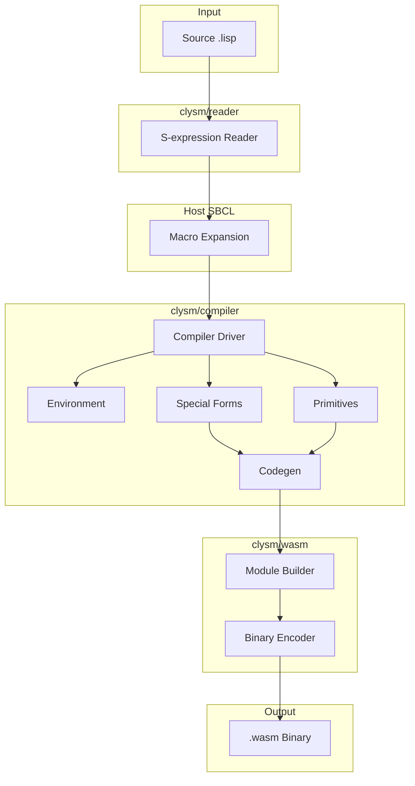
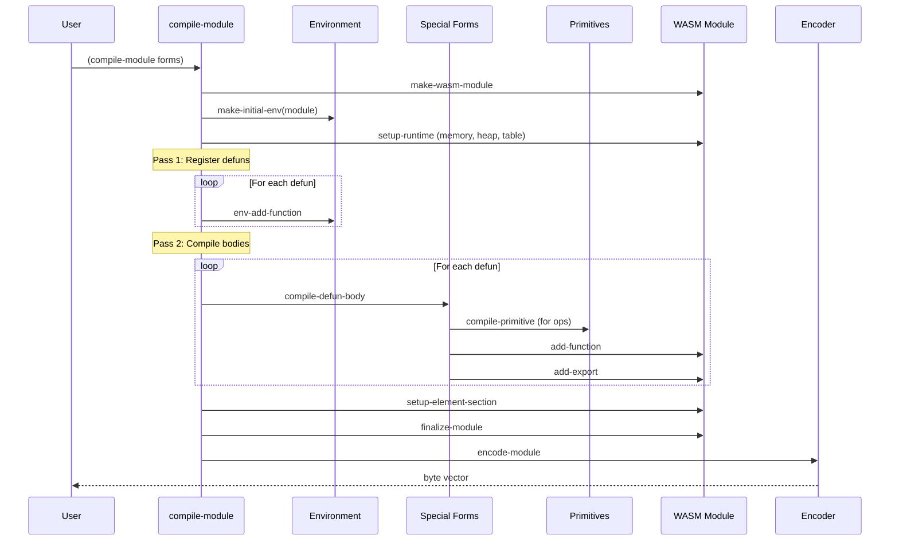

# Clysm Architecture

## 1. Overview

### Purpose
Common Lisp to WebAssembly compiler targeting WasmGC for garbage collection.

### Use Cases
- Compile Common Lisp source to standalone `.wasm` files
- Execute Lisp code in browser/Node.js environments
- ANSI Common Lisp conformance testing via WASM

### Non-Goals
- Full ANSI CL compliance (in progress, partial implementation)
- Production-ready runtime (currently Phase 2 development)
- Debugging support / source maps

## 2. System Architecture



## 3. Execution Flow

### Main Compilation Sequence



## 4. Modules & Dependencies

### Layer Architecture

```
┌─────────────────────────────────────────────────────────────┐
│                         clysm (facade)                       │
├─────────────────────────────────────────────────────────────┤
│  clysm/compiler                                              │
│  ├── compiler.lisp    - Main driver, compile-module          │
│  ├── environment.lisp - compile-env, local/func tracking     │
│  ├── special-forms.lisp - if/let/lambda/block/dotimes...    │
│  ├── primitives.lisp  - +/-/*/cons/car/cdr/funcall...       │
│  └── codegen.lisp     - IR to WASM instruction generation   │
├─────────────────────────────────────────────────────────────┤
│  clysm/ir                                                    │
│  ├── ir.lisp      - IR node classes (ir-const, ir-if, ...)  │
│  ├── convert.lisp - AST to IR conversion                     │
│  └── optimize.lisp - IR optimization passes                  │
├─────────────────────────────────────────────────────────────┤
│  clysm/wasm                                                  │
│  ├── types.lisp       - WASM constants & type structs        │
│  ├── instructions.lisp - Opcode definitions                  │
│  ├── gc-types.lisp    - WasmGC struct/array types           │
│  ├── module.lisp      - wasm-module builder API              │
│  └── encoder.lisp     - Binary format encoder                │
├─────────────────────────────────────────────────────────────┤
│  clysm/utils          - LEB128 encoding, byte buffers        │
│  clysm/reader         - S-expression reader                  │
│  clysm/runtime        - Runtime type tags                    │
│  clysm/stdlib         - Primitive operation registry         │
└─────────────────────────────────────────────────────────────┘
```

### External Dependencies
- `alexandria` - Common utilities
  - `clysm.asd:9`
- `serapeum` - Extended utilities
  - `clysm.asd:10`
- `trivia` - Pattern matching
  - `clysm.asd:11`
- `flexi-streams` - Byte stream handling
  - `clysm.asd:12`
- `fiveam` - Test framework (test system only)
  - `clysm.asd:55`

### Internal Package Dependencies
```
clysm/wasm     <- clysm/utils
clysm/ast      <- (none)
clysm/ir       <- clysm/ast
clysm/compiler <- clysm/wasm, clysm/ast, clysm/ir
clysm          <- all packages
```
- `src/package.lisp:251-253`

## 5. Data Model

### Compilation Environment
```lisp
;; src/compiler/environment.lisp:7-17
(defstruct compile-env
  (locals nil)           ; Alist (name . local-info)
  (functions nil)        ; Alist (name . func-info)
  (globals nil)          ; Alist (name . global-info)
  (types nil)            ; Type definitions
  (module nil)           ; wasm-module being built
  (local-count 0)        ; Next local index
  (func-count 0)         ; Next function index
  (blocks nil)           ; Named blocks for return-from
  (block-depth 0))       ; WASM block nesting depth
```

### WASM Module Structure
```lisp
;; src/wasm/module.lisp:7-22
(defstruct wasm-module
  (types nil)            ; Function/GC type definitions
  (imports nil)          ; Imported functions/memory
  (functions nil)        ; Function definitions
  (tables nil)           ; Function tables (for indirect calls)
  (memories nil)         ; Linear memory
  (globals nil)          ; Global variables
  (exports nil)          ; Exported symbols
  (start nil)            ; Start function index
  (elements nil)         ; Table initialization
  (data nil))            ; Data segments
```

### Runtime Memory Layout
- Heap starts at offset 1024
  - `src/compiler/compiler.lisp:221`
- Cons cell: 8 bytes (car at +0, cdr at +4)
  - `src/compiler/compiler.lisp:211-212`
- Closure: 8-byte header + 4 bytes per captured variable
  - `src/compiler/special-forms.lisp:456-465`

## 6. External Integrations

### Node.js WASM Runner
- Used for ANSI test execution
- Invokes compiled WASM via `uiop:run-program`
  - `tests/ansi/runner.lisp:33-42`

### Output Format
- Standard WebAssembly 1.0 binary format
- Magic: `0x6d736100`, Version: 1
  - `src/wasm/types.lisp:6-7`

## 7. Configuration

### Nix Flake Development Environment
- `flake.nix` provides:
  - SBCL with Quicklisp
  - Node.js for WASM testing
  - Helper scripts: `clysm-load`, `clysm-test`, `clysm-compile`
  - `flake.nix:74-103`

### Environment Variables
- `QUICKLISP_DIR` - Quicklisp installation path (default: `$HOME/.quicklisp`)
  - `flake.nix:16`

### ASDF Configuration
- System: `clysm` (main), `clysm/tests`, `clysm/ansi-tests`
  - `clysm.asd:3,52,70`

## 8. Build & Release

### Test Infrastructure

**Unit Tests (FiveAM)**
- Suite hierarchy: `:clysm` -> `:utils`, `:wasm`, `:compiler`, `:integration`
  - `tests/suite.lisp:7-20`
- Run via: `(clysm/tests:run-tests)` or `clysm-test` script

**ANSI Conformance Tests**
- Custom test framework in `tests/ansi/`
- Compiles test forms to WASM, executes via Node.js
  - `tests/ansi/runner.lisp:49-96`
- Feature map tracks implemented primitives
  - `tests/ansi/feature-map.lisp`

### CI Commands
```bash
# Run unit tests
.bin/clysm-test

# Compile a file
.bin/clysm-compile input.lisp output.wasm
```

## 9. Risks & Improvements

### Risks

1. **Memory Management Fragility**
   - Heap pointer stored in global, incremented but never decremented
   - No garbage collection despite targeting WasmGC
   - `src/compiler/compiler.lisp:214-224`

2. **Incomplete Type System**
   - All values represented as i32
   - No proper type tagging implemented yet
   - `src/runtime/runtime.lisp` defines tags but not used

3. **Limited Control Flow**
   - `tagbody`/`go` not implemented
   - Symbols not yet supported
   - `CLAUDE.md:35-39`

4. **Closure Environment Capture Overhead**
   - Every closure stores environment pointer + captured values
   - `src/compiler/special-forms.lisp:471-571`

### Improvements

1. **Implement WasmGC Struct Types for Runtime Values**
   - Replace linear memory cons cells with GC-managed structs
   - GC type infrastructure exists but unused
   - `src/wasm/gc-types.lisp`

2. **Add Proper Type Tagging**
   - Runtime tags defined but not integrated
   - Enable type checking at runtime
   - `src/runtime/runtime.lisp:3-9`

3. **Optimize Closure Creation**
   - Share closure types by arity (already done)
   - Consider inlining non-escaping lambdas
   - `src/compiler/compiler.lisp:233-246`

4. **Complete ANSI Primitive Coverage**
   - Many list functions missing (mapcar, reduce, etc.)
   - Multiple values not implemented
   - `ROADMAP.md` tracks progress

## 10. Open Questions

- How will symbol interning work in WASM environment?
- Strategy for implementing `multiple-value-bind` / `values`?
- Will CLOS (object system) be targeted, and how?
- Integration approach for browser-side runtime (DOM, etc.)?

## 11. References

### Core Implementation
- `src/compiler/compiler.lisp:128-166` - Main `compile-module` entry point
- `src/compiler/special-forms.lisp:7-27` - Special form dispatch
- `src/compiler/primitives.lisp:7-27` - Primitive dispatch
- `src/wasm/encoder.lisp:289-308` - Module encoding
- `src/wasm/module.lisp:30-91` - Module builder API

### Type System
- `src/wasm/types.lisp:24-49` - WASM value types
- `src/wasm/types.lisp:72-135` - Type structures
- `src/runtime/runtime.lisp:3-9` - Runtime type tags

### Control Flow
- `src/compiler/special-forms.lisp:36-50` - if compilation
- `src/compiler/special-forms.lisp:263-287` - block/return-from
- `src/compiler/special-forms.lisp:291-379` - dotimes/dolist

### Closures
- `src/compiler/special-forms.lisp:385-449` - Free variable analysis
- `src/compiler/special-forms.lisp:471-601` - Lambda/funcall compilation

### Tests
- `tests/suite.lisp:24-26` - Test runner
- `tests/ansi/runner.lisp:129-139` - ANSI test entry point
