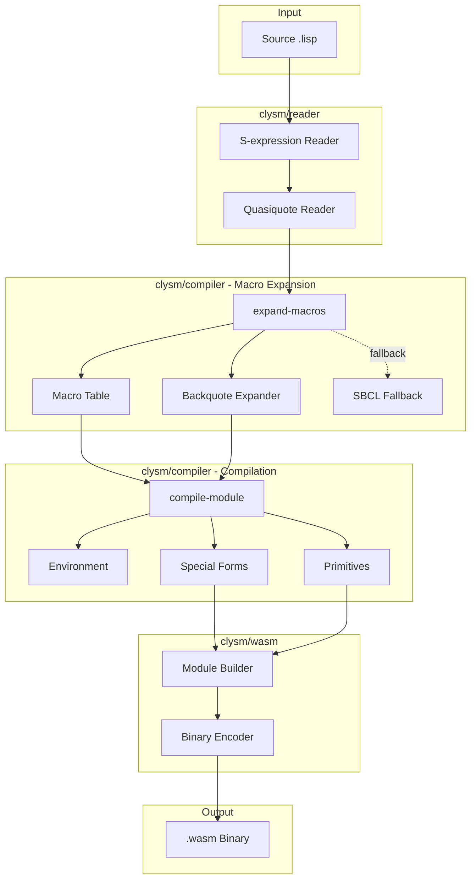
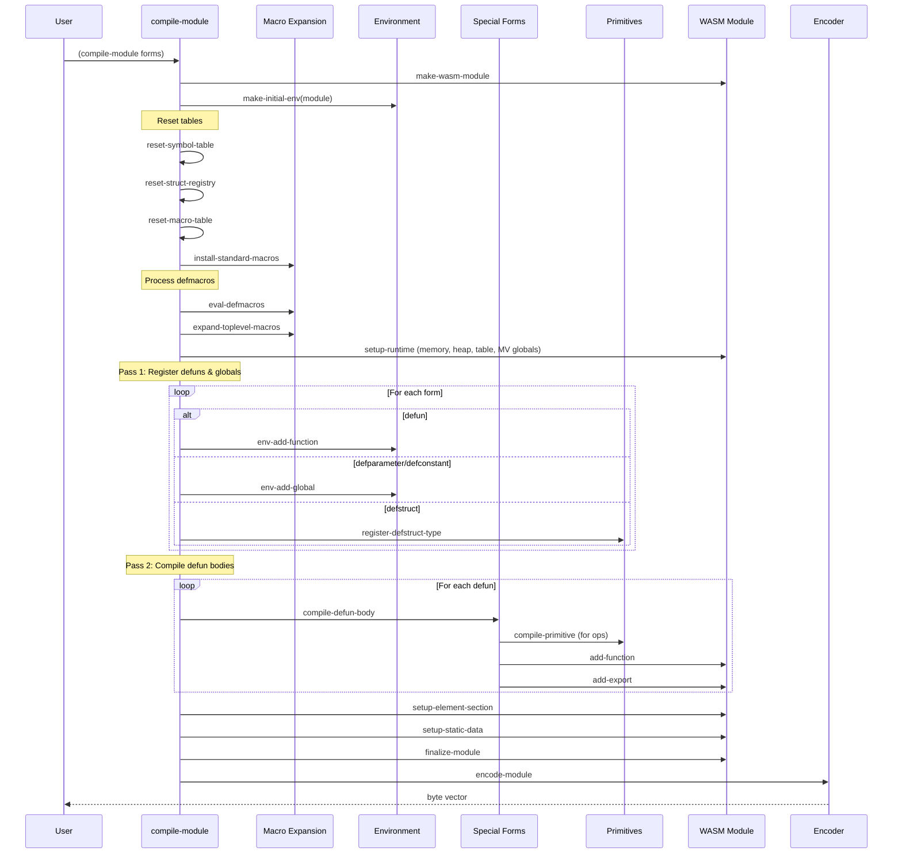

# Clysm Architecture

## 1. Overview

### Purpose
Common Lisp to WebAssembly compiler targeting WasmGC for garbage collection, with a self-hosting bootstrap goal.

### Use Cases
- Compile Common Lisp source to standalone `.wasm` files
- Execute Lisp code in browser/Node.js environments
- Self-hosting: compile the compiler itself to WebAssembly
- ANSI Common Lisp conformance testing via WASM

### Non-Goals
- Full ANSI CL compliance (incremental implementation in progress)
- Production-ready runtime (bootstrap phase)
- Debugging support / source maps
- CLOS (future phase)

## 2. System Architecture


```mermaid
flowchart TD
    subgraph Input
        SRC[Source .lisp]
    end

    subgraph "clysm/reader"
        READER[S-expression Reader]
        QQ[Quasiquote Reader]
    end

    subgraph "clysm/compiler - Macro Expansion"
        MT[Macro Table]
        BQ[Backquote Expander]
        SBCL[SBCL Fallback]
        ME[expand-macros]
    end

    subgraph "clysm/compiler - Compilation"
        ENV[Environment]
        SF[Special Forms]
        PRIM[Primitives]
        COMPILER[compile-module]
    end

    subgraph "clysm/wasm"
        MOD[Module Builder]
        ENC[Binary Encoder]
    end

    subgraph Output
        WASM[.wasm Binary]
    end

    SRC --> READER
    READER --> QQ
    QQ --> ME
    ME --> MT
    ME --> BQ
    ME -.->|fallback| SBCL
    MT --> COMPILER
    BQ --> COMPILER
    COMPILER --> ENV
    COMPILER --> SF
    COMPILER --> PRIM
    SF --> MOD
    PRIM --> MOD
    MOD --> ENC
    ENC --> WASM
```

### Key Design Decisions

1. **Self-Hosting Architecture**: The compiler implements its own macro expansion engine (`clysm-macroexpand-1`) with SBCL fallback for bootstrap
   - `src/compiler/macroexpand.lisp:308-321`

2. **Two-Pass Compilation**: First pass registers all `defun` names, second pass compiles bodies
   - `src/compiler/compiler.lisp:572-660`

3. **Linear Memory Runtime**: Cons cells, closures, and structures allocated in WASM linear memory
   - Heap pointer stored in global variable
   - `src/compiler/compiler.lisp:761-797`

## 3. Execution Flow

### Main Compilation Sequence


```mermaid
sequenceDiagram
    participant User
    participant compile-module
    participant macros as Macro Expansion
    participant env as Environment
    participant sf as Special Forms
    participant prim as Primitives
    participant module as WASM Module
    participant encoder as Encoder

    User->>compile-module: (compile-module forms)
    compile-module->>module: make-wasm-module
    compile-module->>env: make-initial-env(module)

    Note over compile-module: Reset tables
    compile-module->>compile-module: reset-symbol-table
    compile-module->>compile-module: reset-struct-registry
    compile-module->>compile-module: reset-macro-table
    compile-module->>macros: install-standard-macros

    Note over compile-module: Process defmacros
    compile-module->>macros: eval-defmacros
    compile-module->>macros: expand-toplevel-macros

    compile-module->>module: setup-runtime (memory, heap, table, MV globals)

    Note over compile-module: Pass 1: Register defuns & globals
    loop For each form
        alt defun
            compile-module->>env: env-add-function
        else defparameter/defconstant
            compile-module->>env: env-add-global
        else defstruct
            compile-module->>prim: register-defstruct-type
        end
    end

    Note over compile-module: Pass 2: Compile defun bodies
    loop For each defun
        compile-module->>sf: compile-defun-body
        sf->>prim: compile-primitive (for ops)
        sf->>module: add-function
        sf->>module: add-export
    end

    compile-module->>module: setup-element-section
    compile-module->>module: setup-static-data
    compile-module->>module: finalize-module
    compile-module->>encoder: encode-module
    encoder-->>User: byte vector
```

## 4. Modules & Dependencies

### Layer Architecture

```
┌─────────────────────────────────────────────────────────────┐
│                         clysm (facade)                       │
├─────────────────────────────────────────────────────────────┤
│  clysm/compiler                                              │
│  ├── compiler.lisp     - Main driver, compile-module         │
│  ├── environment.lisp  - compile-env, struct-info            │
│  ├── macroexpand.lisp  - Self-hosted macro expansion         │
│  ├── special-forms.lisp - if/let/lambda/block/catch/throw   │
│  ├── primitives.lisp   - +/-/*/cons/car/mapcar/hash-tables  │
│  └── codegen.lisp      - IR to WASM instruction generation  │
├─────────────────────────────────────────────────────────────┤
│  clysm/ir                                                    │
│  ├── ir.lisp       - IR node structs (ir-const, ir-if, ...) │
│  ├── convert.lisp  - AST to IR conversion                   │
│  └── optimize.lisp - IR optimization passes                 │
├─────────────────────────────────────────────────────────────┤
│  clysm/wasm                                                  │
│  ├── types.lisp        - WASM constants & type structs       │
│  ├── instructions.lisp - Opcode definitions                  │
│  ├── gc-types.lisp     - WasmGC struct/array types          │
│  ├── module.lisp       - wasm-module builder API             │
│  └── encoder.lisp      - Binary format encoder               │
├─────────────────────────────────────────────────────────────┤
│  clysm/utils           - LEB128 encoding, byte buffers       │
│  clysm/reader          - S-expression reader + quasiquote    │
│  clysm/runtime         - Runtime type tags (future use)      │
│  clysm/stdlib          - Primitive operation registry        │
└─────────────────────────────────────────────────────────────┘
```

### External Dependencies
- `alexandria` - Common utilities
  - `clysm.asd:9`
- `serapeum` - Extended utilities
  - `clysm.asd:10`
- `trivia` - Pattern matching
  - `clysm.asd:11`
- `fiveam` - Test framework (test system only)
  - `clysm.asd:56`

### Internal Package Dependencies
```
clysm/wasm     <- clysm/utils
clysm/ast      <- (none)
clysm/ir       <- clysm/ast
clysm/compiler <- clysm/wasm, clysm/ast, clysm/ir
clysm          <- all packages
```
- `src/package.lisp:356-370`

## 5. Data Model

### Compilation Environment
```lisp
;; src/compiler/environment.lisp:16-27
(defstruct compile-env
  (locals nil)           ; Alist (name . local-info)
  (functions nil)        ; Alist (name . func-info)
  (globals nil)          ; Alist (name . global-info)
  (types nil)            ; Type definitions
  (module nil)           ; wasm-module being built
  (local-count 0)        ; Next local index
  (func-count 0)         ; Next function index
  (blocks nil)           ; Named blocks for return-from
  (block-depth 0))       ; WASM block nesting depth
```

### Structure Registry
```lisp
;; src/compiler/environment.lisp:53-61
(defstruct struct-info
  (name nil)             ; Structure name symbol
  (type-id 0)            ; Unique type ID for runtime
  (slots nil)            ; List of (slot-name default-value)
  (parent nil)           ; Parent structure for :include
  (constructor nil)      ; make-XXX
  (copier nil)           ; copy-XXX
  (predicate nil))       ; XXX-p
```

### WASM Module Structure
```lisp
;; src/wasm/module.lisp:7-22
(defstruct wasm-module
  (types nil)            ; Function/GC type definitions
  (imports nil)          ; Imported functions/memory
  (functions nil)        ; Function definitions
  (tables nil)           ; Function tables (for indirect calls)
  (memories nil)         ; Linear memory
  (globals nil)          ; Global variables
  (exports nil)          ; Exported symbols
  (start nil)            ; Start function index
  (elements nil)         ; Table initialization
  (data nil)             ; Data segments
  (import-func-count 0)  ; Number of imported functions
  (func-count 0))        ; Number of defined functions
```

### Runtime Memory Layout
- Static data base: offset 256
  - `src/compiler/environment.lisp:161`
- Heap starts at offset 1024
  - `src/compiler/compiler.lisp:768`
- Cons cell: 8 bytes (car at +0, cdr at +4)
  - `src/compiler/compiler.lisp:753-754`
- Symbol: 16 bytes (name-ptr, value, function, plist)
  - `src/runtime/runtime.lisp:23-28`
- Closure: 8-byte header + 4 bytes per captured variable
  - `src/compiler/special-forms.lisp:633-644`
- Structure: 4-byte type-id + 4 bytes per slot
  - `src/compiler/compiler.lisp:928-935`

### Runtime Globals
| Index | Name | Purpose |
|-------|------|---------|
| 0 | heap-pointer | Current heap allocation point |
| 1 | mv-count | Multiple value count |
| 2-9 | mv-0 to mv-7 | Multiple value storage |
| 10 | symbol-table | Runtime symbol table pointer |
| 11 | throw-pending | Catch/throw state flag |
| 12 | throw-tag | Current throw tag |
| 13 | throw-value | Current throw value |

- `src/compiler/compiler.lisp:761-797`

## 6. Macro Expansion System

### Self-Hosted Macro Engine
The compiler includes a complete macro expansion system for self-hosting:

```lisp
;; src/compiler/macroexpand.lisp:308-321
(defun clysm-macroexpand-1 (form)
  "Expand one macro call in FORM."
  (let ((expander (macro-function-p (car form))))
    (if expander
        (values (funcall expander form) t)
        (values form nil))))
```

### Standard Macros (Built-in)
- `when`, `unless` - Conditional evaluation
- `cond` - Multi-branch conditional
- `and`, `or` - Short-circuit boolean
- `case`, `ecase` - Value dispatch
- `typecase`, `etypecase` - Type dispatch
- `dotimes`, `dolist` - Iteration
- `push`, `pop` - List modification
- `incf`, `decf` - Numeric modification
- `typep` - Type predicate
- `src/compiler/macroexpand.lisp:345-434`

### Backquote Expansion
Portable backquote implementation that handles:
- `(quasiquote ...)` - Template form
- `(unquote ...)` - Direct evaluation
- `(unquote-splicing ...)` - Splice into list
- SBCL COMMA object translation during bootstrap
- `src/compiler/macroexpand.lisp:46-159`

### Defmacro Processing
```lisp
;; User defmacros are parsed and registered
(register-defmacro form)
  -> parse-macro-lambda-list
  -> generate-macro-bindings (destructuring)
  -> register-macro
```
- `src/compiler/macroexpand.lisp:327-339`

## 7. External Integrations

### Node.js WASM Runner
- Used for `eval-form` and test execution
- Invokes compiled WASM via `uiop:run-program`
- `src/compiler/compiler.lisp:1114-1145`

### Output Format
- Standard WebAssembly 1.0 binary format
- Magic: `0x6d736100`, Version: 1
- `src/wasm/types.lisp:6-7`

## 8. Configuration

### Nix Flake Development Environment
- `flake.nix` provides:
  - SBCL with Quicklisp
  - Node.js for WASM testing
  - Helper scripts: `clysm-load`, `clysm-test`, `clysm-compile`
- `flake.nix:74-103`

### Self-Hosting Mode
```lisp
;; src/compiler/environment.lisp:10-12
(defvar *self-hosting-mode* nil
  "When T, the compiler uses only portable CL forms.
   When NIL (default), SBCL-specific optimizations are used.")
```

### Environment Variables
- `QUICKLISP_DIR` - Quicklisp installation path (default: `$HOME/.quicklisp`)
- `flake.nix:16`

## 9. Build & Release

### Test Infrastructure

**Unit Tests (FiveAM)**
- Suite hierarchy: `:clysm` -> `:utils`, `:wasm`, `:compiler`, `:integration`, `:bootstrap`
- `tests/suite.lisp:7-20`
- Run via: `(clysm/tests:run-tests)` or `clysm-test` script

**ANSI Conformance Tests**
- Custom test framework in `tests/ansi/`
- Compiles test forms to WASM, executes via Node.js
- Feature map tracks implemented primitives
- `tests/ansi/`

### CI/CD Pipeline
- GitHub Actions workflow
- Runs on push/PR to main/master
- Uses Nix flake for reproducible environment
- `.github/workflows/test.yml:1-35`

### CI Commands
```bash
# Run unit tests
.bin/clysm-test

# Compile a file
.bin/clysm-compile input.lisp output.wasm
```

## 10. Bootstrap Status

### Phase 1: Core Forms (Complete)
- Arithmetic: `+`, `-`, `*`, `/`, `mod`, `rem`, `1+`, `1-`
- Comparisons: `<`, `>`, `<=`, `>=`, `=`, `/=` (multi-arg)
- Boolean: `not`, `null`, `zerop`, `plusp`, `minusp`
- Bitwise: `logand`, `logior`, `logxor`, `lognot`, `ash`
- Control: `if`, `when`, `unless`, `cond`, `and`, `or`, `case`, `ecase`
- Bindings: `let`, `let*`, `setq`, `setf`
- Functions: `defun`, `lambda`, `funcall`, `function`

### Phase 2: Lists (Complete)
- Construction: `cons`, `list`, `list*`
- Access: `car`, `cdr`, `first`-`fourth`, `nth`, `nthcdr`
- Destructive: `rplaca`, `rplacd`
- Predicates: `eq`, `eql`, `consp`, `atom`, `listp`
- Operations: `append`, `reverse`, `nreverse`, `member`, `assoc`, `last`, `length`
- Higher-order: `mapcar`, `mapc`, `reduce`

### Phase 2.5: Advanced Control (Complete)
- Math: `abs`, `max`, `min`, `evenp`, `oddp`, `gcd`, `lcm`
- Rounding: `floor`, `ceiling`, `truncate`, `round`
- Multiple values: `values`, `multiple-value-bind`
- Destructuring: `destructuring-bind`
- Local functions: `labels`
- Control: `block`, `return-from`, `tagbody`, `go`
- Loops: `dotimes`, `dolist`

### Phase 3: Bootstrap (In Progress)
- Structures: `defstruct` with constructor, accessors, predicate, copier, setf, :include
- Globals: `defparameter`, `defconstant`, `defvar`
- Hash tables: `make-hash-table`, `gethash`, `sethash`, `remhash`
- Macros: `defmacro` with destructuring, backquote expansion
- Strings: `string=`, `string-downcase`, `string-upcase`, `string-append`, `schar`
- Control: `catch`, `throw`, `unwind-protect`
- Format: `~A`, `~%`, `~~`

### Remaining for Self-Hosting
- Runtime symbol intern
- Full `loop` implementation (self-hosted)
- Arrays and vectors
- Reader (S-expression parser)

## 11. Risks & Improvements

### Risks

1. **Memory Management Fragility**
   - Heap pointer incremented but never decremented
   - No garbage collection despite targeting WasmGC
   - `src/compiler/compiler.lisp:761-768`

2. **All Values as i32**
   - No proper type tagging implemented yet
   - Runtime type tags defined but not used
   - `src/runtime/runtime.lisp:8-16`

3. **Catch/Throw via Globals**
   - Non-local exit uses global variables
   - Not integrated with WASM exception handling proposal
   - `src/compiler/special-forms.lisp:1142-1235`

4. **Closure Environment Capture Overhead**
   - Every closure stores environment pointer + captured values
   - `src/compiler/special-forms.lisp:698-801`

### Improvements

1. **Implement WasmGC Struct Types for Runtime Values**
   - Replace linear memory cons cells with GC-managed structs
   - GC type infrastructure exists but unused
   - `src/wasm/gc-types.lisp`

2. **Add Proper Type Tagging**
   - Runtime tags defined but not integrated
   - Enable type checking at runtime
   - `src/runtime/runtime.lisp:8-16`

3. **Optimize Closure Creation**
   - Share closure types by arity (already done)
   - Consider inlining non-escaping lambdas
   - `src/compiler/compiler.lisp:806-819`

4. **Complete Reader for Self-Hosting**
   - Current reader uses host CL
   - Need custom reader for WASM environment
   - `src/reader/reader.lisp`

## 12. Open Questions

- How will symbol interning work in WASM environment without host Lisp?
- Strategy for implementing `loop` macro self-hosted?
- Will CLOS (object system) be targeted, and how?
- Integration approach for browser-side runtime (DOM, etc.)?
- Transition strategy from linear memory to WasmGC types?

## 13. References

### Core Implementation
- `src/compiler/compiler.lisp:572-660` - Main `compile-module` entry point
- `src/compiler/compiler.lisp:386-439` - `compile-form` dispatcher
- `src/compiler/special-forms.lisp:17-36` - Special form dispatch
- `src/compiler/primitives.lisp:7-40` - Primitive dispatch
- `src/wasm/encoder.lisp:312-331` - Module encoding
- `src/wasm/module.lisp:24-136` - Module builder API

### Macro System
- `src/compiler/macroexpand.lisp:46-159` - Backquote expansion
- `src/compiler/macroexpand.lisp:164-304` - Lambda list parsing
- `src/compiler/macroexpand.lisp:308-339` - Macro expansion
- `src/compiler/macroexpand.lisp:345-434` - Standard macros

### Type System
- `src/wasm/types.lisp:24-49` - WASM value types
- `src/wasm/types.lisp:72-140` - Type structures
- `src/runtime/runtime.lisp:8-16` - Runtime type tags
- `src/compiler/environment.lisp:53-61` - Structure info

### Control Flow
- `src/compiler/special-forms.lisp:46-60` - if compilation
- `src/compiler/special-forms.lisp:304-328` - block/return-from
- `src/compiler/special-forms.lisp:333-464` - tagbody/go
- `src/compiler/special-forms.lisp:468-556` - dotimes/dolist
- `src/compiler/special-forms.lisp:1142-1235` - catch/throw/unwind-protect

### Closures
- `src/compiler/special-forms.lisp:562-626` - Free variable analysis
- `src/compiler/special-forms.lisp:647-693` - function special form
- `src/compiler/special-forms.lisp:698-801` - Lambda compilation
- `src/compiler/special-forms.lisp:805-831` - Funcall compilation

### Structures
- `src/compiler/compiler.lisp:828-891` - Structure registration
- `src/compiler/compiler.lisp:893-1001` - Accessor/constructor/predicate generation

### Tests
- `tests/suite.lisp:24-26` - Test runner
- `tests/integration/compilation-tests.lisp` - End-to-end tests
- `tests/bootstrap/bootstrap-test.lisp` - Bootstrap feature tests
